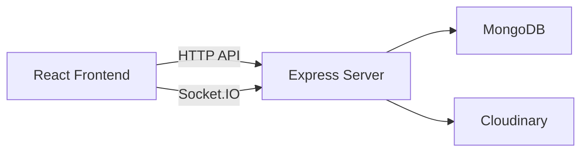
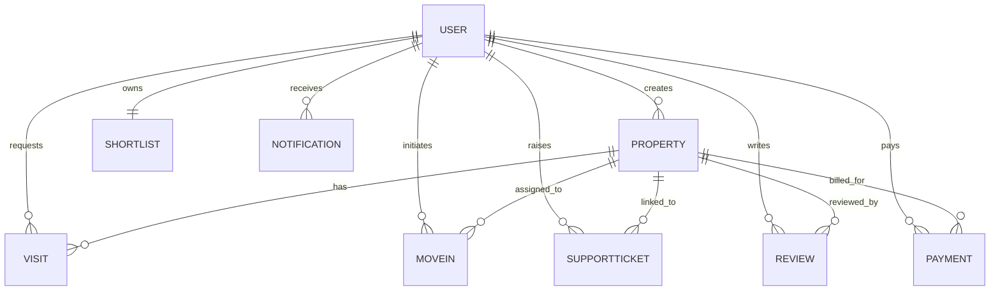

# RentEase

## Full Stack Rental Management Platform

### Major Project Report Template

- Student Name: `<Your Name>`
- Roll Number: `<Your Roll Number>`
- Semester: `6th Semester`
- Course Credits: `3`
- Department: `<Your Department>`
- College: `<Your College Name>`
- Project Guide: `<Faculty Guide Name>`
- Academic Session: `2025-2026`

## Abstract

RentEase is a full-stack rental management platform developed to simplify property discovery and move-in operations for tenants while also supporting owners and administrators. The system allows users to browse property listings, compare rental options, request visits, manage support tickets, track payments, and complete move-in workflows digitally. The platform uses React for the frontend, Express and Node.js for the backend, MongoDB for persistent storage, and Cloudinary for media/document handling. Real-time notifications are supported through Socket.IO, making the system more interactive and practical than a basic CRUD project.

## Problem Statement

Rental accommodation search and onboarding are often fragmented across multiple channels such as phone calls, spreadsheets, chat apps, and physical documents. This project aims to provide one integrated platform where tenants can discover verified listings, request visits, complete move-in tasks, and communicate with administrators efficiently.

## Objectives

1. Build a web-based rental platform with separate flows for tenants, owners, and admins.
2. Implement secure authentication and authorization using JWT.
3. Support property search, comparison, visits, move-in, support, and billing workflows.
4. Store and manage data using MongoDB with structured collections.
5. Add cloud-based upload handling and real-time notifications.
6. Make the system deployment-ready for demonstration and evaluation.

## Scope Of The System

The current version supports:

- user registration and login
- role-based access control
- property listing management
- visit request lifecycle
- shortlist and compare functionality
- move-in checklist and document uploads
- support ticket management
- payment record management
- real-time notifications

The system does not currently include:

- online payment gateway integration
- email or SMS delivery
- AI-based recommendation engine

## Technology Stack

- Frontend: React, Vite, Tailwind CSS, Axios, React Router
- Backend: Node.js, Express.js, Socket.IO
- Database: MongoDB with Mongoose
- Authentication: JWT, bcryptjs
- File Storage: Cloudinary, Multer
- Deployment Targets: Vercel, Render

## Methodology

The project follows a modular full-stack development approach:

1. Define user roles and workflows.
2. Design MongoDB schemas and relationships.
3. Build REST APIs for core operations.
4. Build frontend pages and dashboards role-wise.
5. Integrate validation, authentication, and uploads.
6. Add real-time notifications.
7. Prepare for deployment and documentation.

## System Architecture

## Use Case Diagram

```mermaid
flowchart TB
    Tenant((Tenant))
    Owner((Owner))
    Admin((Admin))

    UC1[Register / Login]
    UC2[Browse Listings]
    UC3[Compare Properties]
    UC4[Request Visit]
    UC5[Manage Move-In]
    UC6[Raise Support Ticket]
    UC7[View Payments]
    UC8[Create Listing]
    UC9[Manage Own Listings]
    UC10[Review Listings]
    UC11[Manage Visits]
    UC12[Manage Tickets]
    UC13[Manage Move-Out]
    UC14[Create Payment Records]

    Tenant --> UC1
    Tenant --> UC2
    Tenant --> UC3
    Tenant --> UC4
    Tenant --> UC5
    Tenant --> UC6
    Tenant --> UC7

    Owner --> UC1
    Owner --> UC8
    Owner --> UC9

    Admin --> UC1
    Admin --> UC10
    Admin --> UC11
    Admin --> UC12
    Admin --> UC13
    Admin --> UC14
```

## Database Design

### Main Collections

1. `User`
2. `Property`
3. `Visit`
4. `Shortlist`
5. `MoveIn`
6. `SupportTicket`
7. `Review`
8. `Notification`
9. `Payment`

## ER Diagram

## Important Modules

### Authentication Module

- user registration
- user login
- token generation
- token-based route protection
- role-based access guard

### Property Management Module

- create, update, delete, review, publish listings
- property search with filters
- compare multiple properties

### Visit Module

- request visits
- schedule visits
- update visit status
- notify tenant of changes

### Move-In Module

- create move-in record
- upload documents
- confirm agreement
- maintain inventory list
- request extension
- request move-out

### Support Module

- create support ticket
- threaded ticket replies
- status updates

### Payment Module

- create payment entries
- track payment state
- notify tenant on due and paid state

### Notification Module

- store notifications in MongoDB
- deliver notifications instantly using Socket.IO
- manage unread/read state

## Security And Validation

The upgraded version includes:

- password hashing using `bcryptjs`
- JWT verification on protected routes
- role-based access control
- request validation using `express-validator`
- Mongoose schema constraints
- protected notification socket rooms by authenticated user ID

## Testing And Verification Checklist

Use this during final demo preparation:

- register a new tenant account
- login as tenant, owner, and admin
- create a property listing
- publish the listing as admin
- request a visit as tenant
- update visit status as admin
- verify live notification appears
- create a support ticket and reply as admin
- complete move-in checklist flow
- create and mark payment as paid

## Deployment Readiness

Deployment-ready additions included in the repository:

- `render.yaml` for backend deployment on Render
- `client/vercel.json` for frontend SPA routing
- `server/.env.example` and `client/.env.example`
- root scripts for running both frontend and backend

## Results / Expected Outcome

The system demonstrates a complete rental workflow with multiple user roles and real-world platform behavior. Compared to a basic CRUD project, it showcases:

- modular frontend and backend architecture
- multiple interrelated database entities
- secure access control
- real-time event delivery
- deployment configuration and project documentation

## Limitations

- no live online payment gateway integration
- no email or SMS notification channel
- limited automated test coverage
- owner dashboard is smaller in scope than tenant and admin flows

## Future Enhancements

1. Integrate Razorpay or Stripe.
2. Add email and SMS notifications.
3. Add AI-based listing recommendations.
4. Add analytics dashboards and charts.
5. Add automated unit and integration tests.
6. Add document verification and e-sign flow.

## Conclusion

RentEase is a strong 6th semester full-stack project because it combines practical business logic, multiple user roles, database design, API development, frontend UI, cloud integration, and real-time communication in one system. The project demonstrates both academic relevance and industry-aligned engineering practices.
